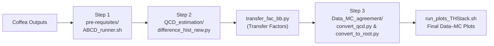

# ABCD Method — QCD Multijet Background Estimation

> Scripts and workflow for estimating the **QCD multijet background** in the electron+jets channel using the data-driven **ABCD method**.

---

## Directory Structure

```text
ABCD/
├── Data_MC_agreement/
│   ├── convert_qcd.py
│   ├── convert_to_root.py
│   ├── plot_stacked_histograms_thesis.C
│   └── run_plots_THStack.sh
├── pre-requisites/
│   ├── ABCD_runner.sh
│   ├── region_abcd_proc.py
│   └── region_runner.py
├── QCD_estimation/
│   ├── difference_hist_new.py
│   └── transfer_fac_bb.py
└── README.md
```

---

## Workflow Overview



---

## Step 1 — Prepare the ABCD Inputs

Navigate to the `pre-requisites` directory and run:

```bash
cd pre-requisites
./ABCD_runner.sh
```

This script processes the Coffea outputs and prepares **all inputs** required for the ABCD background estimation.

---

## Step 2 — Estimate the QCD Background

Move to the `QCD_estimation` directory:

```bash
cd ../QCD_estimation
```

**2.1 — Background-subtract the control regions**

Compute the difference between data and the non-QCD MC prediction for control regions **A** and **C**:

```bash
python3 difference_hist_new.py A
python3 difference_hist_new.py C
```

Produces two JSON files with the background-subtracted distributions for Regions **A** and **C**.

**2.2 — Compute the transfer factors**

```bash
python3 transfer_fac_bb.py regionC regionA
```

Uses Regions **C** and **A** to compute the QCD transfer factors and outputs the corresponding JSON file.

---

## Step 3 — Produce the Final Data–MC Comparison Plots

Navigate to the `Data_MC_agreement` directory:

```bash
cd ../Data_MC_agreement
```

**3.1 — Convert Coffea outputs to ROOT format**

```bash
python3 convert_qcd.py
python3 convert_to_root.py
```

**3.2 — Bring in the transfer factors**

Copy the transfer-factor JSON file generated in Step 2 into the `Data_MC_agreement` directory.

**3.3 — Generate the stacked plots**

```bash
./run_plots_THStack.sh <ERA_NAME>
```

| Placeholder | Description | Example values |
|---|---|---|
| `<ERA_NAME>` | Data-taking era | `2016preVFP`, `2016postVFP`, `2017`, `2018` |

---

## Quick Reference Table

| Step | Directory | Key Script(s) | Output |
|:---:|---|---|---|
| 1 | `pre-requisites/` | `ABCD_runner.sh` | ABCD input files |
| 2 | `QCD_estimation/` | `difference_hist_new.py`, `transfer_fac_bb.py` | Transfer-factor JSON |
| 3 | `Data_MC_agreement/` | `convert_qcd.py`, `convert_to_root.py`, `run_plots_THStack.sh` | Stacked Data–MC plots |

---

## Notes

- Regions **A** and **C** are the control regions used to derive the QCD transfer factor; Region **B** is typically the QCD-enriched region, and Region **D** (signal region) is where the estimate is applied.
- Make sure the transfer-factor JSON from Step 2 is copied into `Data_MC_agreement/` **before** running the plotting script in Step 3.
- Run scripts in order — each step depends on outputs from the previous one.
